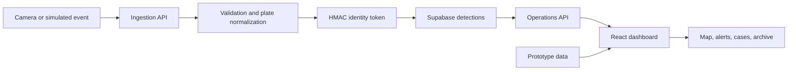

<div align="center">

# BharatANPR

**A privacy-aware automatic number-plate recognition operations platform for traffic intelligence and spatial investigation.**

<p>
  <a href="https://sih2026-ashen.vercel.app/"></a>
  
  
  
</p>

<p>
  <a href="#overview">Overview</a> ·
  <a href="#platform-capabilities">Capabilities</a> ·
  <a href="#system-architecture">Architecture</a> ·
  <a href="#getting-started">Setup</a> ·
  <a href="#project-status">Status</a>
</p>

</div>

---

## Overview

BharatANPR is an operations platform for ingesting, protecting, visualizing, and investigating vehicle-detection events. It combines an interactive map-based command interface with Python and Java service prototypes, a Supabase data model, and an ANPR research workspace.

The system is built for the Smart India Hackathon context and currently supports a simulation-first workflow. When a live API is unavailable, the dashboard falls back to prototype detections, alerts, cases, cameras, and recorded-day data so the complete operational experience remains demonstrable.

[Open the live application](https://sih2026-ashen.vercel.app/)

## Platform capabilities

| Capability | Description |
|---|---|
| Detection ingestion | Accepts normalized camera events through a protected API |
| Privacy-aware identity | Converts normalized plate text into an HMAC token before persistence |
| Live operations | Presents detections, alerts, cameras, vehicle state, and map activity |
| Spatial investigation | Distinguishes observed routes from inferred movement |
| Historical review | Groups detections by recorded day for archive navigation |
| Simulation fallback | Keeps the dashboard usable without a connected operations API |
| Multi-service exploration | Includes FastAPI and Spring Boot backend implementations |
| Model research | Preserves a YOLOv7 number-plate-recognition training notebook |

## System architecture



## Privacy model

The Python ingestion service separates operational identity from raw plate text:

1. Plate text is normalized to uppercase alphanumeric characters.
2. A server-side secret generates an HMAC-SHA256 token.
3. The event stores the token and optional masked plate value.
4. Synthetic OCR text is retained only for simulated records.

This is a prototype privacy control, not a complete compliance guarantee. Production deployment still requires access policies, retention rules, audit trails, encryption controls, and jurisdiction-specific review.

## Technology

| Layer | Technologies |
|---|---|
| Operations dashboard | React 18, TypeScript, Vite, Framer Motion |
| Mapping | MapLibre GL, OpenFreeMap tiles |
| Python API | FastAPI, Pydantic, HTTPX |
| Java service | Java 21, Spring Boot 3.5 |
| Data platform | Supabase and database policies |
| ANPR research | YOLOv7 training notebook |
| Deployment | Vercel for the dashboard |

## Repository layout

```text
.
|-- dashboard/                React operations interface
|-- backend/python/           FastAPI ingestion and spatial API
|-- backend/java/             Spring Boot operations service
|-- supabase/                 Database configuration and migrations
|-- docs/                     Database and platform documentation
|-- archive/                  Preserved project material
|-- yolov7-npr-training.ipynb Model-training workspace
`-- SOURCES.md                Research and source references
```

## Getting started

### Dashboard

```bash
git clone https://github.com/codingyash9-bit/SIH.git
cd SIH/dashboard
npm install
npm run dev
```

The dashboard uses prototype data when `VITE_OPERATIONS_API_URL` is not defined. To connect a backend:

```env
VITE_OPERATIONS_API_URL=http://localhost:8000
```

### Python API

```bash
cd backend/python
python -m venv .venv
```

Activate the virtual environment, then run:

```bash
python -m pip install -r requirements.txt
cp .env.example .env
uvicorn app.main:app --reload --port 8000
```

Verify the service at `http://localhost:8000/health`.

### Java service

```bash
cd backend/java
mvn spring-boot:run
```

## Project status

| Area | State |
|---|---|
| Interactive operations dashboard | Implemented prototype |
| Map and route visualization | Implemented |
| Prototype-data fallback | Implemented |
| Authenticated detection ingestion | Implemented prototype |
| Supabase persistence path | Implemented when configured |
| Java service foundation | Present |
| Production camera integration | Not established |
| Published recognition benchmarks | Not documented |

## Team

Built by **Syntax Syndicate** for Smart India Hackathon 2026.

## Responsible deployment

Automatic number-plate recognition involves sensitive location and identity data. Any real-world deployment should complete a formal privacy, security, bias, retention, and legal review before processing live camera feeds.

---

<div align="center">
  <sub>Built for responsible traffic intelligence and operational clarity.</sub>
</div>
